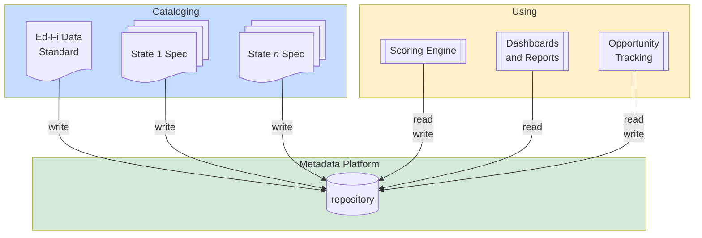

# Data Standard Metadata Collection and Usage — PRD

- Status: Draft
- Owner: Stephen Fuqua
- Last Updated: 2026-06-02
- Related Jira: MC (Metadata Catalog)

## 1. Product Overview

The **Data Standard Metadata Collection and Usage** initiative creates a suite of tools that collect, store, and analyze metadata about Ed-Fi Data Standard implementations — specifically the API specifications and supplemental data collection rules that state education agencies (SEAs) publish for vendors to implement.

The core problem: vendor integration costs are a widely-cited barrier to expanding K-12 data access. Those costs stem from complex, aggregated, and inconsistent requirements across states. By systematically extracting SEA specification metadata into a structured repository, the initiative enables two high-value workflows: (1) a **scoring engine** that measures the complexity of each SEA's requirements, giving Ed-Fi Alliance Staff actionable leverage to help states simplify and standardize; and (2) a **cluster analysis** that surfaces cross-state commonalities, identifying where the Ed-Fi Data Standard itself can be extended or clarified to reduce fragmentation.

Beyond those primary goals, the repository supports additional use cases including a browsable specification viewer, a use case mapping library for vendors entering new markets, a natural language query interface, and an opportunity tracking system for Ed-Fi Alliance Staff to log and monitor standardization conversations with SEAs.

The system is intended for internal Ed-Fi Alliance use first, with selected capabilities exposed to SEA staff and vendors over time. It is explicitly scoped to metadata — no student data or PII flows through any component.

This PRD describes the full initiative scope, while delivery is expected to occur in phases. In other words, the JTBD priorities in this document indicate which capabilities matter across the initiative as a whole; they do not imply that every "must have" item is required in the first release.

### 1.1 Strategic Alignment

This PRD describes systems and processes designed to drive down the cost of vendor integrations with state data collections, the costs of which are reported as a significant barrier to expanded access to K-12 data.

Per reports from these vendors, high implementation costs are driven primarily by:

- Complex requirements ("if A then report X, else report Y, …")
- Aggregations ("report average daily attendance") instead of granular data (daily attendance)
- Inconsistent use of the Data Standard (State A and State B place the same information into different areas of the Ed-Fi Data Standard)

Some requirements described below are not directly applicable to this strategic goal. Consequently, these other requirements — while useful to the Ed-Fi Community — have a lower priority.

#### Lessons Learned from MappingEDU

MappingEDU was an Ed-Fi Alliance project that had some overlap with the requirements in this PRD — particularly: storing specification details, discovering specifications, and storing mappings between systems or use cases. This project was shut down around 2022 for the following reasons:

1. For most of the intended audience, Excel continued to be a better / simpler choice for documenting data mappings.
2. There were fewer than ten consistent users.
3. The custom application stack had accreted significant tech debt, which (at the time) would have cost hundreds of thousands of dollars to remediate, with no clear path to a return on investment.

These observations should be borne in mind when developing solutions for the requirements below.

### 1.2 Target Users and Personas

1. **Ed-Fi Alliance Staff** — primarily members of the Ed-Fi Alliance's product and solutions teams, these individuals have mandates to:
   - Expand the data standard to cover new use cases
   - Absorb common extension solutions into the core model where sensible
   - Help state agencies bring their data collection requirements into close alignment with the core data model, both in terms of using existing elements in the data standard and adhering to core modeling principles (e.g. favoring granular data over aggregations)

2. **SEA Staff** — these individuals design and support a state's data collection efforts. These efforts are primarily focused on policy-driven reporting requirements, and secondarily on data required for research efforts and for services provisioned back to the schools.

3. **Vendors** — whether a business analyst or a programmer, vendor staff need to build integrations with the Ed-Fi Data Standard. They are looking to minimize their cost to build an integration through true standardization across states. In addition, they may be looking for existing use case mappings when trying to break into a new market.

### 1.3 Jobs to Be Done

See [Section 3](#3-jobs-to-be-done) for detailed JTBD stories and acceptance criteria. The table below provides a summary.

> [!NOTE]
> Priority labels in the table below are initiative-wide. Release scope is defined separately in the phased delivery model that follows.

| #       | Job                                         | Primary Persona      | Priority                                |
| ------- | ------------------------------------------- | -------------------- | --------------------------------------- |
| JTBD 1  | Scoring Engine                              | Ed-Fi Alliance Staff | Must have                               |
| JTBD 2  | Cluster Analysis                            | Ed-Fi Alliance Staff | Must have                               |
| JTBD 3  | Standardization of Data Collection Metadata | Ed-Fi Alliance Staff | Must have                               |
| JTBD 4  | Storage of API Specifications               | Ed-Fi Alliance Staff | Must have                               |
| JTBD 5  | Viewing API Specifications                  | All                  | Must have (Staff) / Could have (others) |
| JTBD 6  | Enrichment of API Specifications            | Ed-Fi Alliance Staff | Must / Should have                      |
| JTBD 7  | Storage Engine                              | Ed-Fi Alliance Staff | Must have                               |
| JTBD 8  | Use Case Exploration                        | All                  | Could have                              |
| JTBD 9  | Use Case Mapping                            | All                  | Could have                              |
| JTBD 10 | Natural Language Query                      | All                  | Should have                             |
| JTBD 11 | Opportunity Tracking                        | Ed-Fi Alliance Staff | Must have                               |
| JTBD 12 | SEA Specification Dashboard                 | Ed-Fi Alliance Staff | Must have                               |
| JTBD 13 | SEA Static Report                           | Ed-Fi Alliance Staff | Must have                               |
| JTBD 14 | Human Review                                | Ed-Fi Alliance Staff | Must have                               |
| JTBD 15 | MetaEd Author Feedback                      | Ed-Fi Alliance Staff | Could have                              |

### 1.4 Phased Delivery

The initiative should be delivered in phases so that Ed-Fi can validate value, control cost, and avoid overcommitting to later capabilities before the foundational workflows are proven.

#### Phase 1: Staff operational baseline

JTBD 7, JTBD 4, JTBD 5 for Ed-Fi Alliance Staff, the minimum JTBD 6 capability needed to capture metadata in a usable form, and the minimum JTBD 3 schema / provenance foundation needed to standardize and curate that metadata for later analysis

Phase 1 is intentionally valuable on its own: it gives Ed-Fi Alliance Staff a usable internal repository and viewer for collecting, standardizing, and reviewing SEA specification metadata, including the minimum JTBD 3 schema / provenance model needed for usable metadata capture, before scoring, dashboards, or later external-facing workflows are added.

#### Phase 2: Scoring and automated metadata extraction

The broader JTBD 3 standardization workflow, plus JTBD 1, JTBD 2, JTBD 11, JTBD 12, JTBD 13, and the automated JTBD 6 enrichment needed to support repeatable internal analysis

> [!NOTE]
> At the end of Phase 2, Ed-Fi may choose to stop further delivery if the internal repository, scoring, dashboard/reporting, and opportunity-tracking workflows are already delivering sufficient strategic value. Phases 3 and 4 are therefore best understood as later expansion options, not automatic commitments; if later phases do not justify their added cost and complexity, Ed-Fi should defer them.

#### Phase 3: Use case mapping publication

JTBD 8 and JTBD 9, including publication workflows that let users discover published use cases and mappings without yet opening non-staff editing

#### Phase 4: External contribution workflows

JTBD 9: expanded contribution and governance workflows for non-staff users to create, edit, share, and maintain use case mappings under Ed-Fi-managed permissions and review controls.

JTBD 10 ("Should have"): natural-language query may be pursued after the Phase 3 metadata and mapping foundation is in place; it does not require Gate B (see below) unless Ed-Fi chooses to pair NLQ delivery with broader non-staff contribution workflows.

#### Phase 5: Other use cases and capabilities

JTBDs and potential future use cases, such as: AI skills, MetaEd in-app feedback, and/or other use cases that may emerge over time. These might not be dependent on other phases, so they could be pursued independently if there is a clear value case.

### 1.5 Go / No-Go Criteria

Ed-Fi Alliance will apply explicit go / no-go gates when deciding whether to expand beyond Phase 2 and, if Phase 3 proceeds, whether to open Phase 4 scope.

#### Gate A — Post-Phase-2 expansion decision

Proceed beyond Phase 2 only if all of the following are true:

- Ed-Fi Alliance Staff are actively using the Phase 1-2 repository, scoring, dashboard/reporting, and opportunity-tracking workflows in regular operational work.
- Metadata coverage and extraction quality are high enough that published use case mappings would be credible and maintainable without disproportionate manual cleanup.
- There is a named business sponsor and a documented user need for publishing use case mappings beyond Ed-Fi Alliance Staff.
- The expected value of Phase 3 publication materially exceeds the added product, support, and governance complexity.

If any of the above are not true, Ed-Fi should stop after Phase 2 and treat later phases as deferred.

#### Gate B — Post-Phase-3 external contribution decision

Proceed from Phase 3 to Phase 4 only if all of the following are true:

- Published use case mappings are being used enough to demonstrate sustained demand from non-staff audiences.
- There is clear evidence that read-only publication is insufficient and that non-staff users need to create or edit mappings directly.
- Ed-Fi has defined the permission model, review workflow, and operational ownership needed to govern external contribution safely.
- The support burden and authorization complexity of non-staff editing are justified by the incremental value of opening contribution workflows.

If any of the above are not true, Ed-Fi should keep the product at Phase 3 and avoid opening external contribution workflows.

## 2. Enterprise and System Context

All jobs-to-be-done described in this PRD relate to **metadata**, not to the actual data collected by education organizations. No student data or other PII would flow through the systems built in support of these JTBDs.

The current product direction assumes a single metadata repository at the center of the JTBDs; however, that remains a candidate approach rather than a settled product truth. Further design work could lead to metadata being replicated in more than one repository format if that better satisfies the stated constraints and goals.

**Architectural notes (candidate direction, open for resolution):**

- Could [OpenMetadata](https://open-metadata.org/) support any of this? What about multiple user types? At what cost?
- Working assumption: core requirements may require a bespoke system, but this has not yet been proven.
- A likely repository direction would use a hybrid model supporting:
  - Relational or document storage for use case mapping and opportunity tracking
  - Vector storage for semantic similarity searches

## 3. Jobs to Be Done

### JTBD 1: Scoring Engine

**Story:** As Ed-Fi Alliance Staff — on behalf of Vendors — I want to run a scoring engine that assigns a complexity score to each SEA data collection requirement, so that I can help the SEA align their data collection with the Ed-Fi Data Standard.

**Acceptance Criteria:**

- Ed-Fi Alliance's existing manual scoring SHALL seed the evaluation set, treated as **human-scored observations** (used to measure agreement), not infallible ground truth. Before formal acceptance, Ed-Fi SHALL define the evaluation set and SHOULD grow it — ideally with more than one reviewer — so acceptance testing is credible.
- ≥ 80% score-tier alignment on rows scored by both the engine and a reviewer.
- ≥ 0.7 F1 overall and ≥ 0.9 F1 for "simple" (score-zero) rows, measured against the evaluation set as a calibration signal (not proof of correctness).
- ≥ 0.6 Cohen's Kappa (inter-rater agreement).
- Where the engine and a reviewer disagree on tier, treat those rows as the calibration target — they may point to a methodology question, not just an engine error, so route them to review rather than tuning them away to match one reviewer.
- Ed-Fi Alliance Staff SHALL be able to override the assigned score based on human judgment, with the override and rationale recorded against the row's evidence record.
- **NACHOS Score Context (peer signal).** Every scored row SHALL carry, beside the scalar: _Implementation Shape_ (structural complexity, deterministic from the Swagger/API model), _Documentation Style_ (Prescriptive | Conceptual | Cross-reference | Regulatory | Unspecified), and _Documentation Gap_ (complex structure the documentation under-explains).
- **Semantic-fidelity adjustment.** When a state narrows, broadens, or changes the canonical Ed-Fi meaning of an element, apply an adjustment (exact magnitudes subject to Alliance methodology review).
- **Evidence record (per row).** Every score SHALL emit a cached evidence record (extracted facts, confidence, cited spans, firing rule path, review routing) — extending the provenance model (NFR-DATA-2/3) to the scoring layer, so a score is inspectable without re-running the model.
- Cross-state outputs SHALL report Score Context **distributions**, not a single-scalar ranking that can misread documentation culture as quality.

**Depends on:** JTBD 3 (Standardization of Data Collection Metadata)

**Priority:** Must have

### JTBD 2: Cluster Analysis

**Story:** As Ed-Fi Alliance Staff — on behalf of Vendors — I want to run a periodic cluster analysis that looks for commonalities among different state data collection specifications, so that I can find market-driven (3+ states affected) opportunities to modify the Ed-Fi Data Standard and thereby reduce fragmentation across SEA specifications.

**Acceptance Criteria:**

- Minimal case: infer similarity from keyword matching
- Preferred case: infer similarity from semantic matching
- Outputs SHALL surface candidate commonalities for human review rather than make unattended standardization decisions.
- During Phase 2, cluster analysis is exploratory; usefulness is demonstrated by surfacing patterns that staff judge worth reviewing, not by meeting a fixed precision threshold.
- Cluster analysis SHOULD use the canonical (resource, property) mapping to detect same-model-slot commonality (2+ states with peer extensions / prescriptive patterns on the same Ed-Fi slot) and MAY use Score Context as clustering features; such findings feed Opportunity Tracking (JTBD 11) for human review.

**Depends on:** JTBD 3 (Standardization of Data Collection Metadata)

**Priority:** Must have

### JTBD 3: Standardization of Data Collection Metadata

**Story:** As Ed-Fi Alliance Staff, I want to extract data collection requirements from any SEA and store them in a standardized manner, so that I can analyze and help improve the SEA's requirements.

**Acceptance Criteria:**

- Standardized metadata storage with a schema that can represent normalized metadata plus provenance and curation status
- The standardized repository SHALL preserve provenance and curation status for each material metadata element, including whether it came from exact artifact import, inexact supplemental extraction, or manual editing.
- Phase 1 minimum acceptance: Ed-Fi Alliance Staff SHALL be able to load, store, and manually curate standardized metadata in that repository even before any scoring or other downstream analytical consumer is delivered.
- Ed-Fi Alliance Staff SHALL be able to manually curate standardized metadata regardless of whether it originated from exact import or inexact extraction.
- Phase 2 downstream-consumer readiness: the standardized repository SHALL expose standardized metadata programmatically to the scoring engine and other downstream use cases once those consumers are introduced.
- The schema SHALL be at the **(resource, property) grain** and SHALL map state documentation onto the **canonical Ed-Fi Data Standard surface**, so a source lens and an API-model (coverage) lens are possible.
- The repository SHALL retain the **source narrative text** (or stable, normalized references) sufficient to validate and display _cited spans_; a cited span cannot be shown against source text that was not retained. (The Phase-1 schema should anticipate this.)

**Depends on:**

- JTBD 4 (Extraction of metadata from API specifications)
- JTBD 6 (Extraction of additional metadata rules from other sources: spreadsheet, PDF, web, etc.)

**Priority:** Must have

### JTBD 4: Storage of API Specifications

**Story:** As Ed-Fi Alliance Staff, I want to extract metadata from API specifications derived from the Ed-Fi Data Standard and/or extensions, so that I can use that metadata for various purposes and share the metadata with external users.

**Acceptance Criteria:**

- Exact import of metadata from either OpenAPI artifacts and/or MetaEd artifacts
- Storage of extracted information in a standardized format, with provenance indicating the originating artifact and import method

**Depends on:** JTBD 7 (Storage Engine)

**Priority:** Must have

### JTBD 5: Viewing API Specifications

**Story:** As any type of user, I want to view API specification details, so that I will be able to read and understand the state's data collection requirements.

**Acceptance Criteria:**

- Web-based UI for filtering / drilling into Domains > Entities > Attributes
- The UI SHALL support the provenance and confidence disclosures required by NFR-DATA-3

**Depends on:** JTBD 7 (Storage Engine), JTBD 4

**Priority:**

- Must have for Ed-Fi Alliance Staff
- Could have for other personas

### JTBD 6: Enrichment of API Specifications

**Story:** As Ed-Fi Alliance Staff, I want to extract additional data collection requirements from documentation supplementary to the API specifications, so that I can enrich the collected API specifications with the full range of information required for building integrations with the SEA's data collection API.

**Acceptance Criteria:**

- Inexact extraction of supplemental requirements from documents such as spreadsheets, web pages, PDF files, etc.
- Storage of extracted information in a standardized format, with provenance and confidence indicators that distinguish supplemental extraction from exact artifact import
- Given the variable nature of the source documents, it is not realistic to expect 100% accuracy from automated extraction. When automated extraction is first deployed in Phase 2, 80% accuracy is acceptable; 90% or better remains the desired later-state target.
- The stated enrichment accuracy thresholds are decision points for reviewing the cost/benefit of additional tuning and manual curation, not automatic completion points.
- Ed-Fi Alliance Staff SHALL be able to manually review and edit enriched metadata based on human judgment
- Future option: where explicitly enabled by Ed-Fi governance, SEA staff MAY be allowed to manually edit metadata; this does not need to be solved in the earlier phases.

**Depends on:** JTBD 7 (Storage Engine)

**Priority:**

- Must have: the storage requirements
- Should have: the automation requirements (while manual data entry is not desired, it should not be a complete blocker during the earlier phases of the initiative)

Phase note: Phase 1 minimum acceptance is manual capture and storage of supplemental metadata with provenance / confidence indicators and staff reviewability; automated extraction is deferred to Phase 2.

### JTBD 7: Storage Engine

**Story:** As Ed-Fi Alliance Staff, I want to implement a storage engine for recording metadata that describes the API specification and other rules required for building a client-server integration with an SEA data collection API.

**Acceptance Criteria:**

- The storage engine SHALL run in a managed service environment, preferentially in Azure
- The storage engine SHALL support infrastructure-as-code deployment of schema
- The storage engine SHALL support programmatic access for application workflows and analyst-friendly querying over the metadata repository
- The storage engine SHALL support a query language
- The storage engine SHALL store provenance, confidence, and curation status needed to distinguish exact imports, inexact supplemental extraction, and manual edits
- Metadata to be stored SHALL include at least the following fields (and other fields as implied to fulfil other jobs-to-be-done):
- The storage engine SHALL store multiple versions of the Data Standard and/or state specification, so that a new version does not overwrite data from a prior version

**Resource-level fields:**

| Column               | Example / Notes                                    |
| -------------------- | -------------------------------------------------- |
| Model Name           | `"ed-fi"` or the extension name                    |
| Version              | `5.2.0`                                            |
| Resource Name        | `applicantProfiles`                                |
| Resource Description | `The profile of the person making an application.` |
| Domains              | [`RecruitingAndStaffing`]                          |

**Property-level fields:**

| Column                     | Example / Notes                                        |
| -------------------------- | ------------------------------------------------------ |
| Model Name                 | `"ed-fi"` or the extension name                        |
| Version                    | `5.2.0`                                                |
| Resource Name              | `applicantProfiles`                                    |
| Property Name              | `lastSurname`                                          |
| Property Description       | `The name borne in common by members of a family.`     |
| Data Type                  | `string`                                               |
| Min Length                 | 0                                                      |
| Max Length                 | 75                                                     |
| Validation RegEx           | `[A-Za-z\'\-\.]+`                                      |
| Is Identity Key            | `false`                                                |
| Is Nullable                | `false`                                                |
| Is Required                | `true`                                                 |
| Source Narrative           | (additional text extracted from written documentation) |
| NACHOS Score               | 1                                                      |
| Adjusted NACHOS Score      | 0.5                                                    |
| Reason for Complexity      | `custom descriptor`                                    |
| Why Extension is necessary | `required for state reporting`                         |
| Recommendations            | `Consider for addition to core model`                  |

**Depends on:** No further dependencies

**Priority:** Must have

### JTBD 8: Use Case Exploration

**Story:** As any type of user, I want to explore the Ed-Fi Data Standard and state specifications by use case, so that I can learn how to build either a source or reporting system integration for that use case.

**Acceptance Criteria:**

- Web-based UI for browsing and discovering use cases
- Data dictionary mapping between the use case's data elements and the data element names in the specifications

**Depends on:** JTBD 7 (Storage Engine), JTBD 3, JTBD 9 (Use Case Mapping)

**Priority:** Could have

### JTBD 9: Use Case Mapping

**Story:** As any type of user, I want to load mappings between a use case and the Ed-Fi Data Standard or state specifications into the storage engine for end users to discover.

**Acceptance Criteria:**

- SHALL support import / update from spreadsheet / CSV
- SHOULD support the ability to deprecate a mapping (and reverse)
- SHOULD support the ability to archive a mapping, hiding it from public view (and reverse)
- SHOULD support the following edit rights:
  - Original creator SHALL be able to edit the use case
  - Ed-Fi Alliance Staff SHALL be able to edit the use case
  - Original creator SHALL be able to share editing rights (delegate) with another user
- Anyone SHALL be able to read mappings
- Users SHALL be able to set a status indicator showing if the mapping is work in progress, proposed, or published / used in production
- Could include: support for other formats (to be determined)
- Could include: web-based GUI for manual CRUD operations
- Could include: tracking of vendors or agencies who support or require a given use case

**Depends on:** JTBD 7 (Storage Engine), JTBD 3 (Standardization of Data Collection Metadata)

**Priority:** Could have

Phase note: in Phase 3, editing remains limited to Ed-Fi Alliance Staff; broader non-staff editing is deferred to Phase 4 and only if Gate B is met.

### JTBD 10: Natural Language Query

**Story:** As any type of user, I want to use a natural language query to explore the Ed-Fi Data Standard and state specifications, so that I can find and synthesize information without manually building database queries.

**Acceptance Criteria:**

- Accessible through a chat interface (e.g. in a web application, Slack, or connected to a conversational AI system)
- Must obey the authorization patterns established for the metadata; for example, opportunity tracking data should only be accessible to Ed-Fi Alliance Staff
- Should store user queries for diagnostic purposes
- Should allow users to provide feedback on the responses, for diagnostic purposes

**Sample Queries:**

- "Help me find where to store Intervention data"
- "Which states are using positive daily attendance?"
- "Rank the states by overall extension complexity"
- "Which states are using Data Standard 6?"

**Depends on:** JTBD 7 (Storage Engine), JTBD 3, JTBD 9 (Use Case Mapping)

**Priority:** Should have

Phase note: strategically desirable and intentionally deferred until after the Phase 3 metadata and mapping foundation is in place; Ed-Fi may pursue JTBD 10 independently of Gate B if NLQ is valuable without opening broader non-staff editing workflows.

### JTBD 11: Opportunity Tracking

**Story:** As Ed-Fi Alliance Staff, I want to store notes about proposed changes and SEA responses so that I can track and report on the outcomes from the work to further standardize SEA data collections.

**Acceptance Criteria:**

- Storage of free text notes and potentially pre-defined fields
- SHALL have: web-based UI accessible only to Ed-Fi Alliance Staff
- Could have (details to be determined): web-based UI accessible to other personas

**Depends on:** JTBD 7 (Storage Engine), JTBD 3

**Priority:** Must have

### JTBD 12: SEA Specification Dashboard

**Story:** As Ed-Fi Alliance Staff, I want to view a dashboard summarizing information about any given state specification, so that I can get a sense of the size, scope, and complexity of that specification.

**Acceptance Criteria:**

- SHALL include at least these measures of attributes:
  - Number of attributes
  - Average complexity of attributes
- Should have filtering / roll-up of attributes by:
  - Domain
  - Entity
- SHALL have direct links to access and/or edit specification details
- Could have direct links to use case mappings that reference the state specification
- Future option: make this available to external users, though the complexity analysis may need to remain private

**Depends on:** JTBD 7 (Storage Engine), JTBD 3

**Priority:**

- Must have for Ed-Fi Alliance Staff
- Could have for external users

### JTBD 13: SEA Static Report

**Story:** As Ed-Fi Alliance Staff, I want to generate a static report, similar to the dashboard, so that I can distribute it to SEA staff for review.

**Acceptance Criteria:**

- SHALL be generated as a PDF
- Should be created from an action on the web-based UI dashboard

**Depends on:** JTBD 7 (Storage Engine), JTBD 3, JTBD 12 (Dashboard)

**Priority:** Must have

### JTBD 14: Human Review

**Story:** As Ed-Fi Alliance Staff, I want to review auto-generated state metadata, so that I can approve and/or modify them manually.

**Acceptance Criteria:**

- The UI SHALL have a queue showing new results that require review, with a label of "status: pending"
- The UI SHALL allow the reviewer to mark as approved, which will set "status: approved"
- The UI SHALL allow the reviewer to mark as rejected, which will set "status: rejected" (implies further work is needed, but could not be provided at that time)
- The UI SHALL allow the reviewer to update any data  manually, which will set "status: updated"
  - When updating existing data, the system SHALL retain the historical information for comparison
  - When updating existing data, the system SHALL require the user to provide evidence information

**Depends on:** JTBD 12

### JTBD 15: MetaEd Author Feedback

**Story:** As any persona, when developing a MetaEd model file, I want feedback on implementation shape and documentation gaps, so that I have early signals of improvement opportunities.

**Acceptance Criteria**:

- Must be actionable signals
- Warnings MUST NOT block the Build and Deployment processes

**MVP:**

- A skills-based approach for local agentic "code review" could satisfy this JTBD
- However, the ideal system would run synchronously in the MetaEd BUILD command

## 4. Non-Functional Requirements

### NFR-TECH: Technology Stack

- **NFR-TECH-1:** Backend transactional services MUST use either C# or JavaScript/TypeScript.
- **NFR-TECH-2:** Backend data processing services (scoring engine, ETL) MUST use Python (preferred), JavaScript, or C#.
- **NFR-TECH-3:** Frontend services SHOULD use either React or Alpine.js.
- **NFR-TECH-4:** Data storage SHOULD utilize either managed PostgreSQL or CosmosDB unless there is a strongly compelling reason and comparative cost analysis for an alternative.

### NFR-CICD: CI/CD and Operations

- **NFR-CICD-1:** CI/CD processes MUST be set up using GitHub Actions, conformant with the Ed-Fi Alliance's guidelines for use of GitHub Actions.
- **NFR-CICD-2:** Any custom services SHALL be deployable in at least the following isolated environments:
  - Localhost for development and testing, utilizing Docker Compose orchestration for dependent services
  - Staging / UAT
  - Production
- **NFR-CICD-3:** The system will be maintained by Ed-Fi Alliance staff.
- **NFR-CICD-4:** Ed-Fi Alliance Staff will monitor and maintain the system, including applying security patches, updating dependencies, and addressing any operational issues that arise.
- **NFR-CICD-5:** Ed-Fi Alliance Staff will determine appropriate data retention and backup policies to the metadata repository, consistent with the importance of that data and the cost of storage.

### NFR-TEST: Testing

- **NFR-TEST-1:** Custom code MUST have at least 80% unit test coverage (the remaining 20% typically comes from I/O-connected code, such as HTTP bindings or ORM mappings).
- **NFR-TEST-2:** Integration test coverage MUST demonstrate full system connectivity in core happy path scenarios.

### NFR-BACKEND: Backend Patterns

- **NFR-BACKEND-1:** Backend code MUST use async, retry with exponential backoff, and circuit breaker patterns.

### NFR-SCALE: Scale and Availability

- **NFR-SCALE-1:** Actual application use will be low volume. Web-based UI applications need to be generally available during normal working hours, but do not require scale-out or high availability.

### NFR-LICENSE: Licensing

- **NFR-LICENSE-1:** Any custom software developed MUST be made freely available under the Apache-2.0 license.

### NFR-AUTH: Authentication and Authorization

- **NFR-AUTH-1:** MUST use an OpenID Connect provider for user management. Options to investigate include:
  - Microsoft Entra ID, adding users to Ed-Fi's Azure subscription (could be time-consuming to manage and may not scale well)
  - SSO with the existing Salesforce platform (the approach used with the cancelled MappingEDU product; the Alliance is trying to move away from Salesforce)
  - Keycloak (experience from Ed-Fi Admin App; not currently deployed for production; can store its own users and proxy out to other SSO providers — may be a good solution)

### NFR-INFRA: Infrastructure

- **NFR-INFRA-1:** Any custom services SHOULD run within Azure as managed services (preferred) or container services.
- **NFR-INFRA-2:** Total operational cost is expected to be less than $100/month as a rule of thumb; higher cost might be acceptable but must be reviewed with executive management.

### NFR-DATA: Data Management

- **NFR-DATA-1:** Production database systems require standard weekly full backup, nightly differential backup, and documented rollback/restore processes.
- **NFR-DATA-2:** The metadata repository MUST retain provenance, confidence, and curation status sufficient to distinguish exact artifact imports, inexact supplemental extraction, and manual edits.
- **NFR-DATA-3:** When provenance or confidence would reasonably change whether a user trusts or acts on displayed metadata—for example, when a value came from inexact supplemental extraction rather than exact artifact import—the web-based UI MUST surface that context to the user.

## 5. System Architecture

This section captures candidate architectural components and constraints that appear compatible with the current PRD. It is intended to guide later design work, not to assert that the final product architecture has already been settled.

| Component                        | Description                                                                                    | Technology Candidates                                                       | Deployment Target                       |
| -------------------------------- | ---------------------------------------------------------------------------------------------- | --------------------------------------------------------------------------- | --------------------------------------- |
| Metadata Storage Engine          | Central repository for API specification metadata, use case mappings, and opportunity tracking | PostgreSQL (relational) + pgvector[^1] or CosmosDB (hybrid document/vector) | Azure managed service                   |
| API Specification Extractor      | Converts OpenAPI / MetaEd files to standardized metadata                                       | Python or C# ETL service                                                    | Azure container or function             |
| Document Enrichment Service      | Extracts supplemental rules from spreadsheets, PDFs, web pages                                 | Python (preferred) with LLM assistance                                      | Azure container or function             |
| Scoring Engine                   | Classifies and scores attribute complexity                                                     | Python LLM/ML service                                                       | Azure container or function             |
| Cluster Analysis                 | Identifies commonalities across SEA specifications                                             | Python ML / NLP service                                                     | Azure container or function (scheduled) |
| Web Application                  | UI for browsing specs, dashboard, opportunity tracking, use case exploration                   | React or Alpine.js frontend + C#/TS backend                                 | Azure App Service or Static Web App     |
| Natural Language Query Interface | Chat-based query layer over the metadata store                                                 | LLM + RAG over vector store                                                 | Azure container or managed AI service   |
| Identity Provider                | Authentication and authorization for all services                                              | Keycloak / Microsoft Entra ID / Salesforce SSO                              | Azure container or managed service      |

[^1]: vector storage may be need for semantic search capabilities in the cluster analysis and natural language query components.

## 6. Out of Scope and Known Limitations

- **No student data or PII** — the systems described here operate on metadata only.
- **External participation in metadata curation or mapping workflows** — deferred pending evidence from Phases 1-2 and the explicit go / no-go gates for later phases.
- **External user ownership of specification data** (JTBD 6) — not required in Phases 1-2; deferred unless later phases justify it.
- **External user access to opportunity tracking** (JTBD 11) — not part of Phases 1-2 and not assumed unless later evidence supports it.
- **Public-facing complexity analysis** (JTBD 12) — complexity scores may need to remain private if the dashboard is opened to external users.
- **Unattended standardization from cluster analysis** — JTBD 2 is intended to support staff review in Phase 2, not to make automatic standardization decisions without human judgment.
- **Full automation accuracy** — 100% accuracy in automated document enrichment (JTBD 6) is not expected; when automation is first introduced in Phase 2, 80% is acceptable as a review threshold, not as a declaration that tuning work is complete.
- **High availability / scale-out** — not required given the expected low volume of use.
- **MappingEDU feature parity** — this system is not intended to replicate MappingEDU; lessons learned from that project should inform scope decisions.
- **Later phases may be skipped** — Ed-Fi should stop after Phase 2 if the ROI for publication, external contribution, or natural-language features is not compelling.

## 7. Open Questions and Decision Log

| #    | Question                                                                                                                    | Status | Decision / Notes                                                                                                                                                                                                                                          |
| ---- | --------------------------------------------------------------------------------------------------------------------------- | ------ | --------------------------------------------------------------------------------------------------------------------------------------------------------------------------------------------------------------------------------------------------------- |
| OQ-1 | Could [OpenMetadata](https://open-metadata.org/) satisfy any of these JTBDs? What are the multi-user and cost implications? | Open   | Working assumption: a bespoke system may be required, but this should be validated                                                                                                                                                                        |
| OQ-2 | Which OpenID Connect provider should be used? (Entra ID, Salesforce SSO, Keycloak)                                          | Open   | Keycloak appears most promising given prior experience and flexibility                                                                                                                                                                                    |
| OQ-3 | Should vector storage be co-located with relational storage (e.g. pgvector) or a separate service?                          | Open   | —                                                                                                                                                                                                                                                         |
| OQ-4 | What evidence must Ed-Fi gather at each phase gate to justify proceeding beyond Phase 2 and, if applicable, beyond Phase 3? | Open   | Seed with Sections 1.4 and 1.5; convert those gate criteria into explicit review evidence such as staff usage logs, extraction-quality samples, sponsor sign-off, published-mapping usage metrics, governance workflow drafts, and support-cost estimates |
| OQ-5 | By the end of Phase 2, has cluster analysis surfaced enough useful candidate commonalities to justify continued investment? | Open   | If not, keep it exploratory or defer further expansion work                                                                                                                                                                                               |

## 8. Glossary

| Term                | Definition                                                                                                                                                                                            |
| ------------------- | ----------------------------------------------------------------------------------------------------------------------------------------------------------------------------------------------------- |
| Ed-Fi Data Standard | The Ed-Fi Alliance's canonical data model for K-12 education data exchange.                                                                                                                           |
| SEA                 | State Education Agency — a state-level government body responsible for K-12 education policy and data collection.                                                                                     |
| MetaEd              | The Ed-Fi Alliance's domain-specific language for defining data model extensions.                                                                                                                     |
| OpenAPI             | A specification format for describing REST APIs (formerly Swagger).                                                                                                                                   |
| MappingEDU          | A discontinued Ed-Fi Alliance tool for documenting and discovering data mappings (shut down ~2022).                                                                                                   |
| Reference dataset   | A set of examples reviewed and scored by people, used to check an automated method performs. Not treated as infallible truth - disagreements can signal methodology gaps, not only automation errors. |
| Curation status     | A simple label showing the current human-review or edit state of a metadata element, such as whether it was imported as-is, extracted from supplemental material, or manually edited.                 |
| ETL                 | Extract, Transform, Load — a data integration pattern.                                                                                                                                                |
| RAG                 | Retrieval-Augmented Generation — an LLM technique that grounds responses in a retrieved document corpus.                                                                                              |
| F1 Score            | A measure of predictive accuracy combining precision and recall (used in JTBD 1 acceptance criteria).                                                                                                 |
| Cohen's Kappa       | A statistical measure of inter-rater agreement, used here to assess scoring engine consistency.                                                                                                       |
| JTBD                | Job to Be Done — a framework for describing user goals in terms of outcomes rather than features.                                                                                                     |
| PII                 | Personally Identifiable Information.                                                                                                                                                                  |
| Resource            | A class of objects in the Ed-Fi API, e.g. Student or School, containing a collection of Properties. Alias: entity                                                                                     |
| Property            | A discrete value, a collection (array) of values, or an object containing additional properties. Alias: element                                                                                       |
