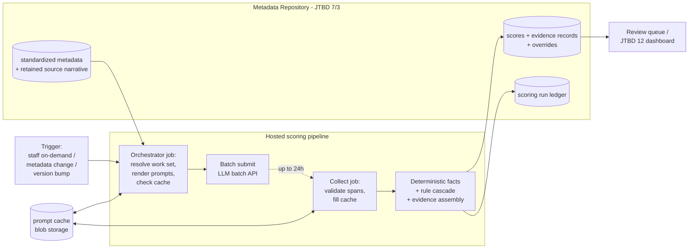

# Scoring Engine (JTBD 1) — Hosted Pipeline Candidate Design

* Status: Draft — candidate design for discussion, not settled architecture
* Author: Chris Moffatt (Touchdown Consulting)
* Relates to: [*Data Standard Metadata Collection and Usage* PRD (PR #1)](https://github.com/Ed-Fi-Alliance-OSS/Metadata-Catalog/pull/1) — JTBD 1 (Scoring Engine), JTBD 3 (Standardization of Data Collection Metadata), Phase 2 (Scoring and automated metadata extraction)
* Source system: NACHOS POC-3 — [github.com/touchdownllc/nachos-ai-poc-3](https://github.com/touchdownllc/nachos-ai-poc-3) (private; project team members have access)
* Last updated: 2026-06-11

---

## 0. Purpose

The PRD's Phase 2 calls for operationalizing the NACHOS scoring engine: taking the scoring approach proven in the 2026 proof-of-concept work ("POC-3") and running it as an automated, hosted pipeline that reads standardized metadata and writes scores with evidence records, per the JTBD 1 acceptance criteria.

This document is a candidate design for that pipeline, in the same spirit as the PRD's System Architecture section — intended to guide later design work, not to assert the architecture is settled. It covers:

1. What the POC scoring pipeline already is, and which of its properties carry into production (§1–§2)
2. Two integration approaches — a target state where scoring reads the metadata repository through a schema contract (§3), and a phased bridge that hosts the POC chain end-to-end first (§4)
3. An assumed trigger model (§5) and a compute platform comparison left open for the team's decision (§6)
4. A cost model against NFR-INFRA-2 (§7), cross-cutting concerns (§8), and open questions proposed for the PRD decision log (§9)

A note on the source system: the POC-3 codebase lives at [touchdownllc/nachos-ai-poc-3](https://github.com/touchdownllc/nachos-ai-poc-3). The repository is currently private — project team members have access; links will not resolve for other readers — and transferring it to the Ed-Fi Alliance organization under Apache-2.0 (per NFR-LICENSE-1) is assumed as a prerequisite step of this work. For the scoring methodology in plain English, see [`docs/methodology.md`](https://github.com/touchdownllc/nachos-ai-poc-3/blob/main/docs/methodology.md) in that repo; for the dual-lens ingestion rationale, [`docs/lens-architecture.md`](https://github.com/touchdownllc/nachos-ai-poc-3/blob/main/docs/lens-architecture.md); load-bearing methodology calls are recorded as ADRs under [`docs/adr/`](https://github.com/touchdownllc/nachos-ai-poc-3/tree/main/docs/adr).

---

## 1. The POC scoring pipeline being operationalized

### 1.1 The shape: extract-then-rule

The POC pipeline never asks an LLM to assign a score. The LLM extracts narrow, checkable **facts** — binary / categorical / count values, each with verbatim evidence spans quoted from the state's own documentation — and a deterministic rule cascade composes those facts into dimension scores. The earlier POC iterations measured the alternative directly: monolithic LLM scoring achieved 57.5% exact-match against human review on the calibration state, versus 80.2% for extract-then-rule on the same data. The architecture choice is empirical, and preserving it is the most important constraint on operationalization.

The pipeline today is a CLI-driven chain run by an operator in sequence:

| # | Stage | What it does | LLM? | Output |
| --- | --- | --- | --- | --- |
| 1 | Spine fetch / build | Pull each state's live Ed-Fi API Swagger; build the canonical spine catalog | No | Per-state spine JSON |
| 2 | Ingest + backfill + gap surface | Parse the state's source documentation (XLSX / Confluence / web / API); enrich against the spine; emit element sets at the (resource, property) grain | No | Per-state element records (22-field contract) |
| 3a | Fact extraction | Extract facts per documented row — 25 spine-lens facts (12 LLM + 13 deterministic), 29 source-lens (13 LLM + 16 deterministic). One versioned prompt per LLM fact; strict JSON output schema; evidence spans validated as substrings of retained source text and downgraded if they fail | **Yes** | Per-fact JSONL artifacts |
| 3b | Rule aggregation | Deterministic rule cascade combines facts into dimension scores — the NACHOS scalar (0–4.5: complexity tier 0–3 plus extension adjustments) and the two-axis Integration Profile (structural depth × documentation style, with a documentation-gap flag) | No | Per-record evidence sidecar JSON |
| 4 | Reports | Analyst workbooks (XLSX), coverage reports, review queue with routing (POLICY / DATA_MODEL / SCORING / ANALYST), human-comparison digests | No | XLSX / JSON / Markdown |

### 1.2 Properties already production-shaped

Cost discipline during the POC forced several properties a hosted service needs anyway:

* **Idempotent, resumable runs.** Each (state, lens, fact) unit of work skips if its artifact reports complete; a run manifest is stream-written; a killed run resumes at no additional LLM cost.
* **The prompt cache is the checkpoint.** Cache keys are `SHA-256(prompt text + model id + prompt version)`, append-only. A re-run within the same versions reads entirely from cache at $0. Bumping a prompt version *is* the cache-invalidation mechanism — there is no separate invalidation logic to get wrong.
* **Batch transport exists.** The pipeline supports the LLM provider's batch API (50% of list price, up-to-24-hour turnaround) with a submit/collect split — exactly the shape a hosted scheduler needs.
* **Cost governance is built in.** A cost cap is enforced across the whole fan-out; a dry-run estimator prices a run before it happens; every cached call records tokens and USD.
* **Determinism.** Temperature-0 extraction, confirmed byte-deterministic over the API transport. Re-runs are reproducible.
* **Versioning discipline.** A scoring-plan version pins the methodology and per-fact prompt versions pin extraction behavior; both are recorded in every output header, with architecture decision records documenting each bump.
* **Quality machinery.** A ~1,700-test suite including golden artifacts, contract-shape tests, and policy-discipline guards: scoring rules are *forbidden by test* from consulting narrative text — they may only consult extracted facts and deterministic field-presence booleans. (This guard exists because an earlier POC iteration demonstrated the failure mode it prevents.)
* **Human-review routing.** Low-confidence facts, unverifiable spans, and unresolved verdicts flag rows for review with a route — the starting point for the PRD's review workflow.

### 1.3 Properties that must change

* **Local filesystem as the store.** Spines, element sets, fact artifacts, cache, sidecars, and workbooks all live in a working directory on one machine.
* **A human as the orchestrator.** Stage ordering and regeneration chains live in operator runbooks, not code.
* **Ingestion is fused into the same codebase**, and parts of it cannot run unattended: the Texas spine requires the locally-run TSDS Vendor SDK Docker stack, and fresh scrapes of the TWEDS documentation portal require a headless browser. §4 addresses this.
* **XLSX workbooks as the primary consumer surface.** In the product, the metadata repository plus the JTBD 12 dashboard take that role; workbooks become one export among several.
* **Secrets and identity.** A raw API-key environment variable; no service identity, no audit trail of who ran what.

---

## 2. A schema contract on both sides of the scorer

The PRD already separates extraction (JTBD 4/6) from scoring (JTBD 1), connected by the standardized repository (JTBD 3). Architecturally this means the scoring engine's only coupling to the rest of the system is two contracts, and the adapter for them should be built first under either approach in this document.

**Input contract — what scoring needs from the repository (JTBD 3):** essentially the POC's 22-field element record, which is already at the PRD's (resource, property) grain:

* identity: state, resource, property, canonical Ed-Fi mapping, extension attribution
* structure: data type, required/nullable/identity flags, descriptor enumeration, and reference shape — the structural-depth facts need the canonical model reachable (FK chain depth, reference fan-out, sub-collections)
* narrative: definition text, business-rules text, and retained source narrative with stable references — the PRD already requires this (JTBD 3: "a cited span cannot be shown against source text that was not retained")
* provenance: documentation source, documented flag, curation status (NFR-DATA-2)

**Output contract — what scoring writes back (JTBD 1):** the POC's per-record sidecar aligns with the JTBD 1 acceptance criteria nearly clause for clause:

| JTBD 1 acceptance criterion | POC artifact that satisfies it today |
| --- | --- |
| Evidence record per row: extracted facts, confidence, cited spans, firing rule path, review routing | Sidecar per-row record: fact values + confidence + verbatim spans + matched rule per dimension + needs-review flag and route |
| Score Context: Implementation Shape / Documentation Style / Documentation Gap | Integration Profile: structural-depth axis (deterministic from the Swagger model) × documentation-style axis, plus a documentation-gap quadrant flag |
| Semantic-fidelity adjustment | Scope-delta / fidelity-divergence adjustments carried in the score justification string |
| Score inspectable without re-running the model | Sidecar + cache; nothing needs recomputation to audit a score |
| Staff override with rationale, recorded against the evidence record | **Gap** — overrides do not exist in the POC; designed in §8.4 |
| Distributions, not single-scalar rankings | The cross-state scoring report already rolls up distributions; the JTBD 12 dashboard inherits this |

The operationalization work is therefore not "rebuild the scorer for the repository." It is: write a **repository adapter** (read the input contract into element records; write sidecar records into repository tables) and keep stages 3a/3b unchanged. Everything between the two adapters — prompts, fact schemas, cache, deterministic facts, rule cascade — moves as-is, with its test suite.

---

## 3. Approach A — repository-fed scoring service (target state)

Scoring becomes a stateless job that wakes on a trigger, pulls its work set from the metadata repository, runs extract-then-rule, and writes scores plus evidence back. No ingestion code in the service; the extraction services (JTBD 4/6) populate the repository on their own track.

**Run flow:**

1. **Trigger** carries `(scope, reason)` — e.g. `(state=MN, metadata-updated)`, `(all, plan-version-bump)`, `(state=AZ, staff-requested)`.
2. **Resolve work set.** Query the repository for rows in scope that are unscored, changed since last scoring, or stale against the current scoring-plan / prompt versions. The cache makes over-selection cheap — unchanged rows cost nothing.
3. **Extract.** Render prompts, check cache, submit only cache misses to the batch API, record the batch manifest in the run ledger, and exit. Small work sets (roughly under $5 estimated) can run synchronously and skip the wait.
4. **Collect** (scheduled wake-up): poll batch status; when complete, pull results into the cache, validate evidence spans against retained source narrative, downgrade facts whose spans don't verify.
5. **Score.** Compute deterministic facts, run the rule cascade, assemble evidence records.
6. **Write back, versioned.** Scores and evidence records are written as new versions keyed by (row, scoring-plan version, prompt versions, model). Prior versions and human overrides are never overwritten (§8.4). The run ledger records scope, versions, model, token spend, USD, span-validation rate, and review-flag counts.
7. **Notify.** Review-queue deltas surface to staff; the JTBD 12 dashboard reads the new scores.

**What changes in POC code:** a repository adapter replacing the file-path layer; the operator runbook ordering encoded as the job's internal step sequence; the CLI retained as the localhost development harness per NFR-CICD-2.

**What does not change:** prompts, fact schemas, cache, deterministic facts, rules, aggregation, the test suite, the versioning discipline.

**Schedule dependency:** Approach A requires the repository to exist and the JTBD 3 schema to carry the full input contract — including retained narrative. If the schema work lands late, scoring operationalization idles. That risk is why Approach B exists.

---

## 4. Approach B — phased: host the POC chain first, swap the input later

### Phase B1 — containerize the POC as-is

Containerize the existing pipeline with the local working directory swapped for cloud storage (blob mount or sync step). One scheduled-or-manual job runs the full chain per state: spine fetch → ingest → backfill/gap → fact extraction (batch submit) → collect → aggregate → reports. Workbooks, sidecars, and review-queue outputs land in shared storage for staff.

Hosted-ingestion notes from the POC's five states: Arizona's and Indiana's source workbooks are static files (trivially hostable); Minnesota fetches its Data Mapping Matrix from a public GitHub repository; Wisconsin scrapes a public Confluence wiki (a retry-on-flaky-network case). Texas is the hard case: its spine comes from the locally-run TSDS Vendor SDK Docker stack and fresh TWEDS scrapes need a headless browser. Preferred mitigation: run the Texas spine fetch and TWEDS scrape as a pre-step that publishes pinned artifacts to cloud storage, refreshed manually or quarterly — the spine changes rarely. Fallbacks: run the TSDS stack as a sidecar container in the job, or keep Texas ingestion operator-run.

### Phase B2 — swap the input side

When the repository and extraction services land, the ingestion stages drop out of the job and the same repository adapter from Approach A takes their place. Output writing moves from blob JSON/XLSX to repository tables; workbook export remains as a report option.

### Why the bridge is worth considering

* An automated scoring pipeline exists early, reducing scoring's schedule dependency on the storage and extraction tracks.
* Hosting, secrets, cost, and operational patterns get validated on the real workload before repository integration adds its own variables.
* The current analyst deliverables keep refreshing automatically while methodology iteration with Ed-Fi reviewers continues.

### The main risk

Bridges become permanent. The mitigation is structural: B1 is built against the same two contracts as Approach A — the file-backed element reader and sidecar writer implement the same adapter interface the repository versions will. B2 then becomes a dependency swap plus a migration script, not a rewrite. If B1 ships without that interface, it is a second POC, not a bridge.

---

## 5. Trigger model (assumed for both approaches)

* **On-demand per state.** Staff (or, later, a repository change event) request scoring for a state. Typical incremental cost is a few dollars (§7).
* **Version-bump full re-score.** A scoring-plan or prompt version bump triggers a full re-score. Rule-only bumps cost ~$0 (facts stay cached); prompt bumps re-extract only the affected fact.
* **Batch API by default; synchronous escape hatch.** Batch halves LLM cost, and the workload has no latency requirement (NFR-SCALE-1). The up-to-24-hour turnaround dictates the orchestration shape — submit-then-exit, collect-on-schedule — which is the main thing the platform choice in §6 must do gracefully.
* Scheduled wholesale re-scores are *not* assumed (they add cost without new information when nothing changed), but a weekly drift check — re-resolve work sets and score anything new — is cheap and worth having.

---

## 6. Compute platform comparison (left open for the team)

All three candidates satisfy NFR-INFRA-1 (Azure managed/container services), NFR-TECH-2 (Python), NFR-CICD-1 (GitHub Actions for CI/CD), and the cost ceiling. Compute cost is negligible at this volume in every case; LLM spend dominates regardless of platform (§7).

| | **Azure Container Apps Jobs** | **GitHub Actions as runner** | **Azure Functions (Durable)** |
| --- | --- | --- | --- |
| Model | Scale-to-zero container jobs; manual / cron / event triggers | Workflows in the public repo run the pipeline; cron + manual dispatch | Function per stage; durable orchestration with native timers |
| Fit for submit → 24h wait → collect | Good: submit job + scheduled collect job; state in the run ledger | Workable: scheduled collect workflow polls; state via blob storage | Strongest: one orchestration sleeps on a durable timer across the wait |
| Runtime limits | Long-running jobs fine (configurable timeout) | 6h per job — fine for submit/collect, tight for a large synchronous run | Activity functions need chunking discipline |
| Cache/state persistence | Blob/Files mount; natural | Must push/pull blob each run (the Actions cache is evictable — not suitable as the prompt-cache home) | Blob bindings; natural |
| Secrets/identity | Managed identity + Key Vault | OIDC federation to Azure / repo secrets; public-repo hygiene needs care | Managed identity + Key Vault |
| Cost at this volume | ~$1–5/mo | $0 compute (public repo) + storage pennies | ~$0–5/mo consumption |
| Ops burden | One container image, two job definitions | None beyond the repo itself | Most moving parts; durable-function idioms to learn |
| Fit with existing practice | Container/compose experience transfers | Highest — the Alliance already governs Actions org-wide | Lowest |
| Main drawback | One more Azure resource set to own (NFR-CICD-3/4) | A CI system doubling as a production scheduler: logs, secrets, and auditability in a public repo; environment rebuilt per run | Architecturally elegant but heavy for a low-volume batch job |

One reading of the trade-offs, for discussion: Container Apps Jobs is the most defensible production home under NFR-CICD-4's staff-maintenance clause; GitHub Actions is a legitimate Phase-B1 bridge runner (zero new infrastructure while the team is busiest) with a planned graduation; Durable Functions is the best technical fit for the batch wait and the least familiar to maintain. A B1-on-Actions → A-on-Container-Apps path is coherent if the team prefers to defer the Azure footprint decision until the storage evaluation (PRD OQ-1) settles, since both will likely land in the same resource group.

---

## 7. Cost model (NFR-INFRA-2)

LLM spend, from POC actuals (Sonnet-class model; batch pricing where noted):

| Scenario | Cost | Notes |
| --- | --- | --- |
| Full cold re-score, 5 states × 2 lenses, batch | ~$22–26 | Synchronous ≈ $44–52. ~16k spine-lens + ~14k source-lens eligible rows |
| Onboard one new state, cold | ~$5 | Most recent state onboarded in the POC: $4.91 actual |
| Re-run, nothing changed | ~$0 | Cache hit on every row |
| Rule-layer version bump (no prompt change) | ~$0 | Facts stay cached; only aggregation re-runs |
| One prompt bumped, all states | ~$2–4 per fact | Only that fact re-extracts |
| Full three-POC prototyping cycle (POC-1 + 2 + 3) | ~$1,000 | Total LLM spend across the entire arc, including two discarded architectures and all methodology iteration — an upper anchor for "what does heavy churn cost" |

Steady state (4–6 states, occasional refresh plus roughly one methodology bump per quarter): **$10–40/month LLM + $1–10/month infrastructure** — inside NFR-INFRA-2's $100 rule of thumb with room. The variable that breaks the ceiling is state count: at ~$5/state cold, a 50-state catalog is ~$250 per full cold re-score, and every prompt-version bump re-pays the affected fact's share across all states. The PRD already requires executive review for costs above the threshold; growth toward national coverage makes that review inevitable, so it is worth scheduling in advance.

---

## 8. Cross-cutting design points (both approaches)

**8.1 Versioning and reproducibility.** Every run-ledger entry pins the scoring-plan version, per-fact prompt versions, and the model id; every score row carries them. Because the cache key includes the model id, a model upgrade is automatically a cold run. Treat it as a deliberate evaluation event — re-score, compare against the prior version and the human-comparison evaluation set per JTBD 1, then promote — rather than letting the default model drift silently. The model id is pinned in configuration.

**8.2 Secrets, identity, resilience.** API keys in Key Vault (or environment secrets) with a service identity per environment (NFR-CICD-2's localhost / staging / production split); the run ledger provides the who-ran-what audit trail. The LLM client's existing retry behavior is extended to the full async / retry-with-backoff / circuit-breaker pattern per NFR-BACKEND-1. No PII anywhere in the system — the PRD's metadata-only scope holds.

**8.3 Observability.** The POC's run manifest becomes the run ledger; alert on job failure and on quality canaries: span-validation failure rate, low-confidence fact rate, review-queue volume by route. A spike in any of these after an upstream change is the early warning that extractor output drifted under the scorer.

**8.4 Human override — the one JTBD 1 must-have the POC lacks.** Overrides are curation rows in the repository, not edits to engine output: (row key, overridden score, rationale, author, timestamp), surfaced alongside the engine's evidence record. Re-scores write new engine versions but never touch override rows; the dashboard shows both, with the override winning for display. Disagreement between an override and the engine is itself a calibration signal — the PRD says to route such rows to review, not tune them away.

**8.5 Testing and CI.** The existing ~1,700-test suite (goldens, contract shapes, policy-discipline guards) becomes the CI gate per NFR-TEST-1; the repository adapter gets contract tests against the JTBD 3 schema. The policy-discipline guard — scoring rules must never consult narrative text — is worth promoting from POC convention to a stated acceptance criterion of the production engine.

**8.6 Headline-output calibration.** Whether the primary published output is a binary complex/not-complex flag (with the 0–3 tier underneath for triage) or the scalar itself is an open calibration question under discussion against the JTBD 1 acceptance metrics. It is a presentation-layer decision: the engine emits both today, and nothing in this design moves whichever way it resolves.

**8.7 Code home and licensing.** Operationalization is the natural moment to transfer the POC codebase to the Ed-Fi Alliance organization under Apache-2.0 (NFR-LICENSE-1) and align its CI with the Alliance's GitHub Actions guidelines (NFR-CICD-1).

---

## 9. Open questions (proposed additions to the PRD decision log)

| # | Question | Why it matters |
| --- | --- | --- |
| D-1 | Does the JTBD 3 schema carry the full scoring input contract — especially retained source narrative for span validation? | Approach A is blocked without it; cited spans cannot be validated without retained narrative (the PRD's JTBD 3 retention clause covers this — the question is schema-design follow-through) |
| D-2 | Texas spine/TWEDS sourcing in a hosted world: is a pinned-artifact pre-step acceptable, or does TEA offer a fetchable alternative to the local TSDS Vendor SDK? | The only state ingestion that cannot run unattended today |
| D-3 | Where do analyst workbooks live long-term once the JTBD 12 dashboard exists — export-on-demand, or scheduled drop? | Determines how much of the reporting layer moves into the product versus remains a development tool |
| D-4 | LLM provider account ownership for production: whose key, what rate/batch quotas, what budget alerting? | Cost governance needs an owner before automation makes spending easy |
| D-5 | Commit to the Phase-B1 bridge now, or hold for the storage decision (OQ-1) and go straight to Approach A? | The sequencing question; the bridge only pays off if started early |
| D-6 | Platform pick from §6 — and if B1 runs on GitHub Actions, agree the graduation criteria to the production platform up front | Prevents the bridge from quietly becoming the destination |

---

## Appendix — POC → hosted stage mapping

| POC stage | Approach A (repository-fed) | Approach B1 (bridge) |
| --- | --- | --- |
| Spine fetch / build | Replaced by the repository + canonical Ed-Fi model import (JTBD 4) | Job step; Texas from pinned artifacts |
| State ingest / backfill / gap surface | Replaced by extraction services (JTBD 4/6) writing the repository | Job step, unchanged code |
| Fact extraction | Job step, unchanged core; input via repository adapter | Job step, unchanged; input from blob storage |
| Batch collect | Scheduled collect job | Scheduled collect job/workflow |
| Rule aggregation | Job step, unchanged rules; output via repository adapter to score/evidence tables | Job step, unchanged; output to blob sidecars |
| Reports / workbooks / review queue | JTBD 12 dashboard reads the repository; XLSX as an export option | Job step; workbooks to shared storage |
| Prompt cache | Blob container, persistent across runs | Same |
| Run manifest | Run ledger table in the repository | Manifest JSON in blob (same fields) |
| Operator runbooks | Encoded as orchestrator step sequence | Encoded as job/workflow steps |
